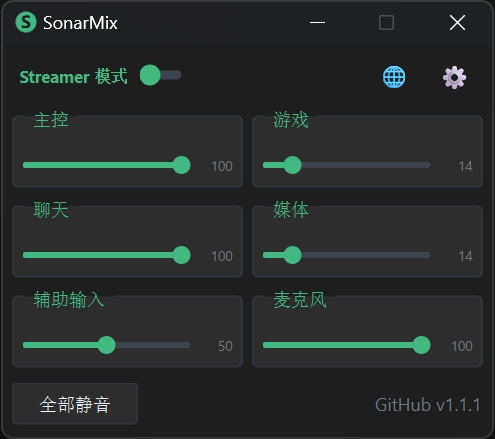
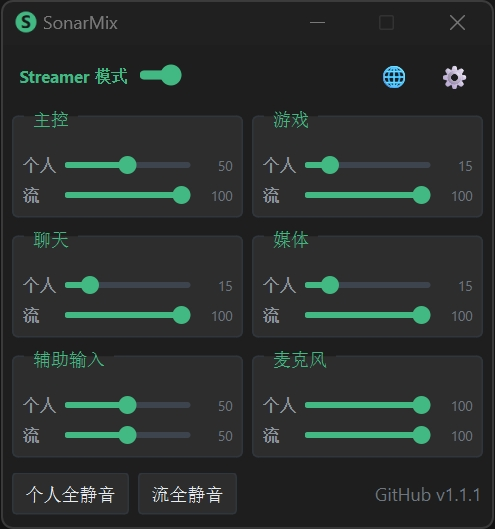
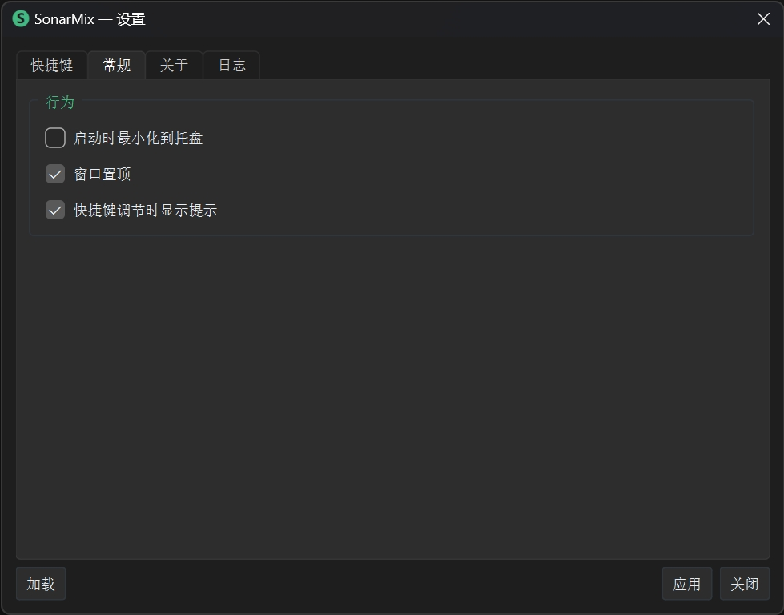

<h1 align="center">SonarMix</h1>

<p align="center">
  <em>基于 PySide6 的 <strong>SteelSeries GG Sonar</strong> Windows 系统托盘音量混音器<br/>全局快捷键 + 中英双语 + Streamer/普通模式一键切换</em>
</p>

<p align="center">
  <a href="LICENSE"></a>
  <a href="https://github.com/Brett-Now/SonarMix/stargazers"></a>
  <a href="https://github.com/Brett-Now/SonarMix/releases"></a>
  <a href="#技术栈"></a>
  <a href="#技术栈"></a>
</p>

<p align="center">
  <a href="README.md">English</a> | <b>简体中文</b>
</p>

---

## 截图

<p align="center">
  <table align="center">
    <tr>
      <td align="center"><b>Classic 模式</b></td>
      <td align="center"><b>Streamer 模式</b></td>
    </tr>
    <tr>
      <td align="center"></td>
      <td align="center"></td>
    </tr>
    <tr>
      <td align="center" colspan="2"><b>设置界面</b></td>
    </tr>
    <tr>
      <td align="center" colspan="2"></td>
    </tr>
  </table>
</p>

---

## 功能特性

| 分类 | 详情 |
|------|------|
| **紧凑主面板** | 2×3 网格布局，6 个频道组，窗口置顶 |
| **Streamer / 普通** | 一键切换 12 滑块（监测 + 流）或 6 滑块 |
| **系统托盘** | 左键切换显示/隐藏，右键菜单：设置 / 退出 |
| **全局热键** | 可配置按键组合，每频道音量±/静音，最多 37 组绑定 |
| **Toast 提醒** | 快捷键调节时暗色卡片式弹窗 |
| **中英双语** | 内置一键语言切换 |
| **YAML 配置** | 快捷键和设置保存在 `config.yaml`，应用内可视化编辑 |
| **拖拽保护** | 拖动滑块时暂停快捷键和定时刷新 |

---

## 环境要求

- **Windows 10 或 11**
- **SteelSeries GG** 已安装并启用 Sonar
- **Python 3.10+**（或使用打包好的 `.exe`）

---

## 快速开始

```bash
# 安装依赖
pip install steelseries-sonar-py PySide6 keyboard PyYAML

# 运行
python main.py
```

### 打包为 .exe

```bash
pip install pyinstaller
pyinstaller --onefile --windowed --name SonarMix --icon=app.ico \
    --add-data "config.yaml;." \
    --hidden-import ssl --hidden-import _ssl --hidden-import certifi \
    --collect-data certifi \
    main.py
```

> [!NOTE]
> 如果热键在你的系统上无响应，请尝试以管理员身份运行 — `keyboard` 库的全局钩子在部分 Windows 配置下可能需要提权。

---

## 配置

程序目录下的 `config.yaml`：

```yaml
# 示例 — 在设置窗口（齿轮图标 ⚙）中添加你自己的快捷键
hotkeys:
  master_mon_up: Numpad8
  master_mon_down: Numpad5
  toggle_window: Ctrl+Shift+S

settings:
  always_on_top: true      # 窗口置顶
  language: zh             # zh（中文）或 en（英文）
  show_toast: true         # 快捷键调节时显示提示
  start_minimized: false   # 启动时最小化
```

打开**设置**窗口（齿轮图标 ⚙）可使用可视化快捷键编辑器 — 点击任意格子后按下组合键即可录入。

---

## 项目结构

```text
SonarMix/
├── main.py          # 入口：模块组装、定时刷新
├── mixer_ui.py      # 主窗口：滑块网格、模式开关、静音按钮
├── settings_ui.py   # 设置窗口：快捷键编辑器、常规设置、关于
├── sonar_ctrl.py    # Sonar API 封装（快照、设音量、静音）
├── hotkey.py        # 全局热键管理 + Toast 弹窗
├── tray.py          # 系统托盘图标 + 右键菜单
├── i18n.py          # 中/英双语翻译字典
├── theme.py         # 暗色主题配色（Vue 风格）
├── config.yaml      # 用户配置：快捷键、设置
└── pyproject.toml   # Python 项目元数据
```

---

## 技术栈

| 层面 | 组件 |
|------|------|
| **API** | [steelseries-sonar-py](https://github.com/Mark7888/steelseries-sonar-py) |
| **GUI** | [PySide6](https://pypi.org/project/PySide6/)（Qt 6） |
| **热键** | [keyboard](https://pypi.org/project/keyboard/) |
| **配置** | [PyYAML](https://pypi.org/project/PyYAML/) |
| **打包** | [PyInstaller](https://pypi.org/project/pyinstaller/) |

---

## 致谢

本项目基于 Mark7888 的 [**steelseries-sonar-py**](https://github.com/Mark7888/steelseries-sonar-py)，该库封装了 SteelSeries GG Sonar 的本地 HTTP API。

---

## 已知限制

- **热键可能需提权** — `keyboard` 钩子在部分 Windows 配置下可能需要管理员身份运行
- **必须运行 GG** — SonarMix 是控制器，不是独立混音器
- **模式切换时序** — Streamer ↔ Classic 切换后 GG 需短暂重建音频图

---

## 免责声明

1. 本工具仅供**个人使用和技术参考**。
2. SonarMix 是**非官方第三方控制器**——与 SteelSeries 无任何关联、背书或合作关系。
3. `keyboard` 库在系统层面挂钩键盘事件，使用前请确认符合系统安全策略。
4. 作者**不承担**因使用本软件导致的音频硬件问题、系统不稳定或任何其他后果的责任。
5. 请勿用于任何**违法、违规或侵犯他人权益**的用途。

---

## 开源协议

MIT — 详见 [LICENSE](LICENSE)

```
Copyright (c) 2026 Brett Now
```
